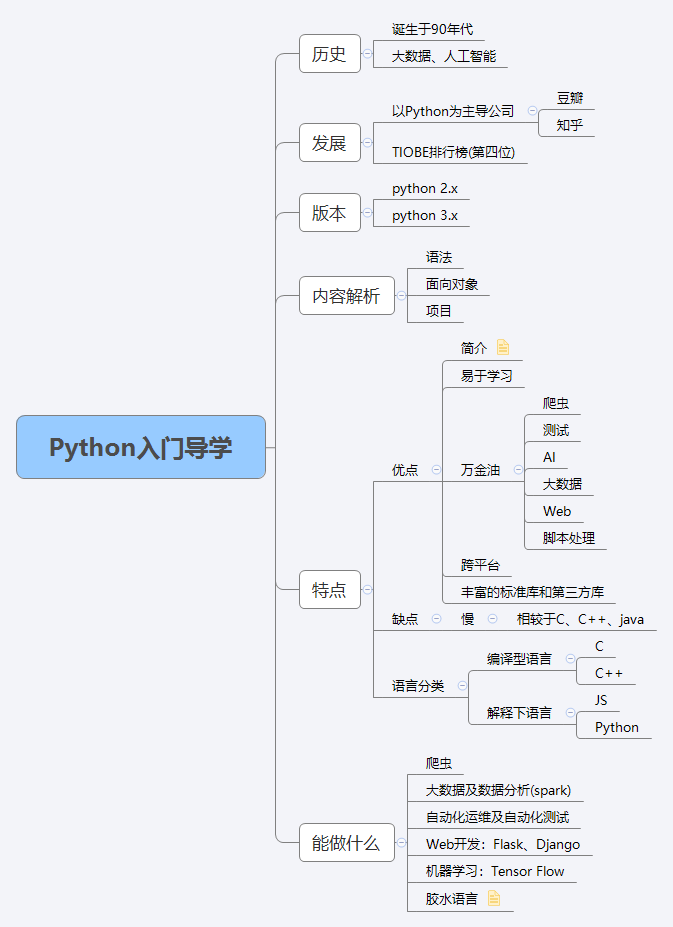

# Python入门导学
# 前言
学习一门语言，先要了解一下它的历史；Python并不是一门新的语言，诞生于上世界90年代初期，随着大数据和人工智能的流行，Python逐渐流行起来。Python就像一个技术的润滑剂，很多技术型公司或多或少会用到。
# Python知多少
##  Python 版本
- python 2.x
- python 3.x

## Python特点
### 优点
- 简洁
- 易于学习
- 跨平台
- 丰富的标准库和第三方库
- 面向对象语言

### 缺点 
- 相较于C、C++、java

### Python能做什么
- 爬虫
- 大数据及数据分析(spark)
- 自动化运维及自动化测试
- Web开发：Flask、Django
- 机器学习：Tensor Flow
- 胶水语言

# 思维导图

